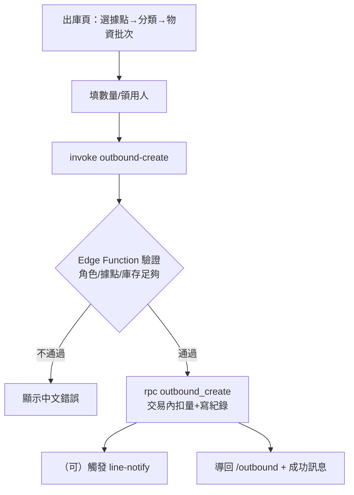
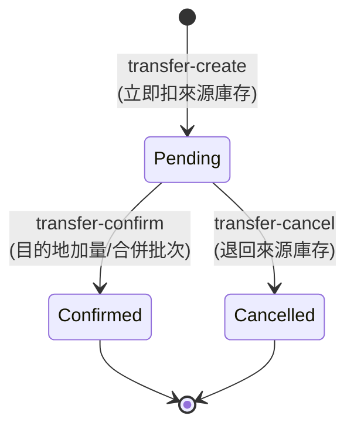
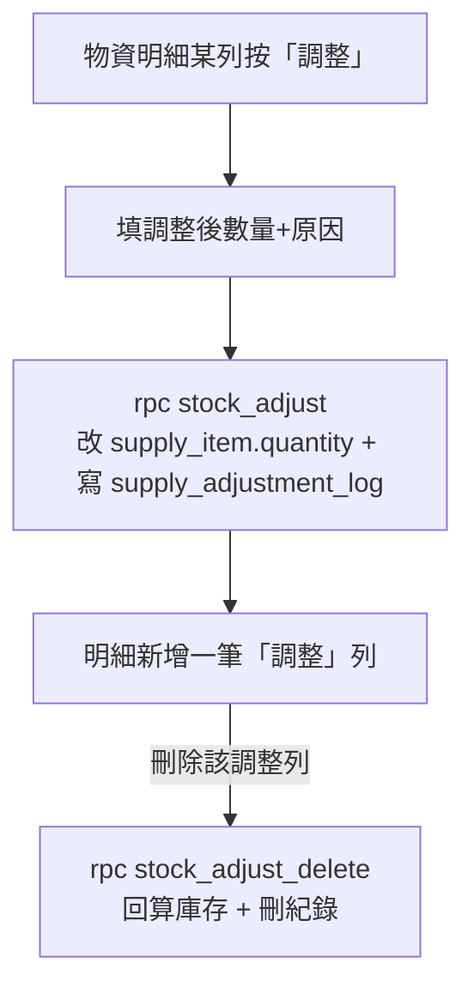
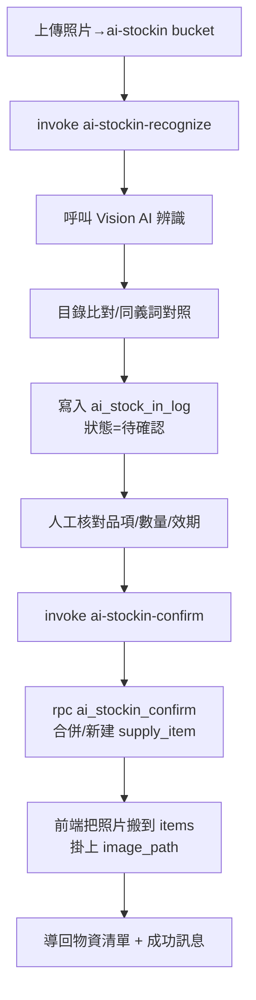
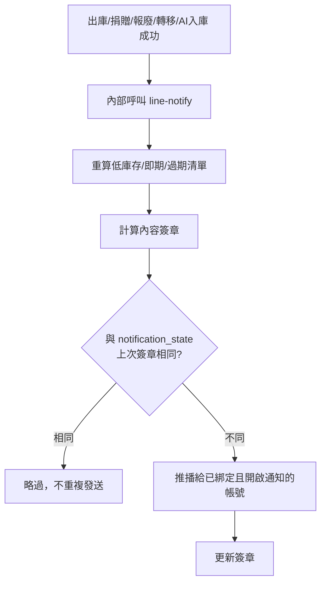
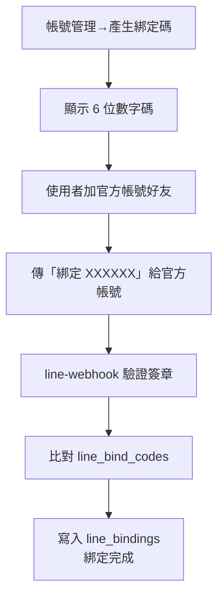
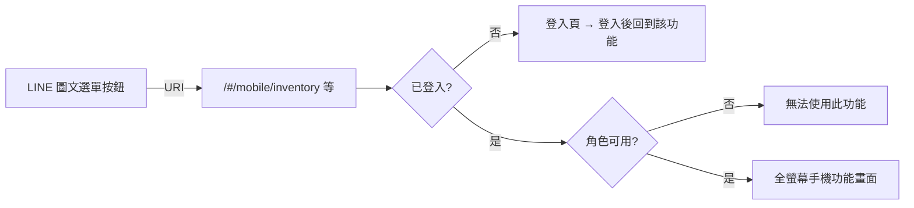
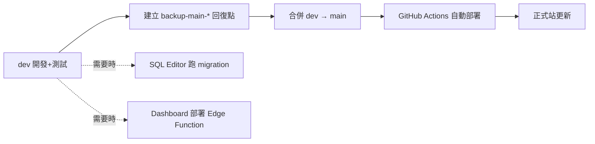

# 流程圖（Flow）

> 以 Mermaid 繪製，GitHub / 支援 Mermaid 的 Markdown 檢視器可直接看圖。

## 1. 登入與權限守門

```mermaid
flowchart TD
    A[開啟任一網址] --> B{已登入?}
    B -- 否 --> C[導向 /login<br/>記住原路徑]
    C --> D[輸入帳號密碼]
    D --> E[帳號轉 {帳號}@local.invalid<br/>Supabase Auth 驗證]
    E -- 失敗 --> D
    E -- 成功 --> F[讀 profiles 取角色/據點]
    F --> G[導回原本要去的頁面]
    B -- 是 --> H{RoleGate 角色符合?}
    H -- 否 --> I[無權限畫面 / 隱藏]
    H -- 是 --> J[顯示功能]
```

## 2. 物資出庫



## 3. 跨據點轉移（狀態機）



## 3b. 缺料舉手 → 轉移補貨

```mermaid
flowchart TD
    A[戰情總覽點狀態卡→狀態清單] --> B{狀態?}
    B -- 已過期 --> R[報廢：帶批次進報廢頁]
    B -- 缺料(低庫存/即期/總量不足) --> C[按「舉手」]
    C --> D[需求方=登入據點<br/>來源=物資所在據點]
    D --> E[寫入 supply_request (Open)]
    E --> F[戰情總覽「待處理需求」顯示]
    F --> G[按「轉移補貨」→ 轉移頁 ?requestId=<br/>自動帶好來源/目標/品項]
    G --> H[完成→標記 Fulfilled / 取消→Cancelled]
```

## 3c. 盤點調整（物資明細）



## 4. AI 影像入庫



## 5. LINE 通知（被動式）



## 6. LINE 帳號綁定



## 7. 手機頁面 / LINE 圖文選單串接



## 8. 發布流程


